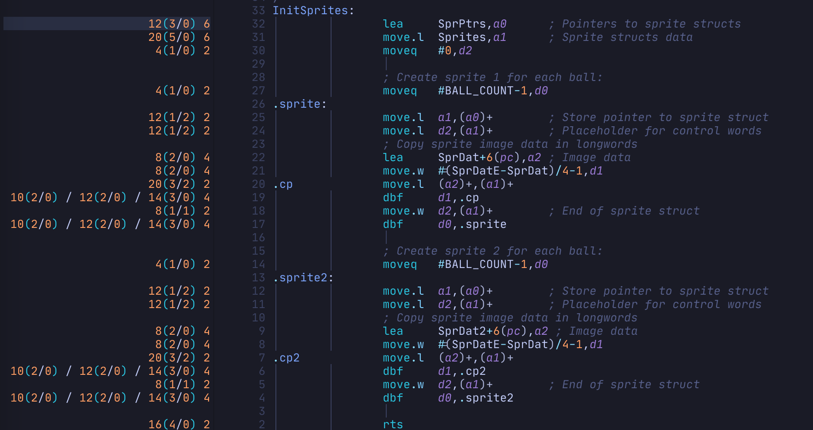

# 68kcounter-nvim

Neovim plugin for [68kcounter](https://github.com/grahambates/68kcounter/)

Analyses 68000 assembly source to profile resource and size data. For each
instruction it will tell you:

- CPU cycles
- Bus read cycles
- Bus write cycles
- Size in bytes



## Dependencies

- neovim 0.9+
- 68kcounter 3.2+ npm package installed globally: `npm i -g 68kcounter`

## Installation

Install using your preferred plugin manager e.g. Packer.

You can configure 68kcounter by passing a table to the setup function.
The following options are available and set by default:

```lua
-- Using packer
use({
    "grahambates/68kcounter-nvim",
    config = function()
        require("68kcounter").setup({
           -- path to 68kcounter node cli tool (default assumes global path)
           bin_path="68kcounter"
        })
    end,
})
```

## Usage

Your assembly files should be using the `asm68k` or `asm` filetype.

Counts are displayed to the left of the current window.
Once open, they will be live-updated as you edit or switch files.

| Command        | Description                            |
|----------------|----------------------------------------|
|`:CounterShow`  | Show counts for current window/buffer  |
|`:CounterHide`  | Hide the counts window                 |
|`:CounterToggle`| Toggle visibility of the counts window |
